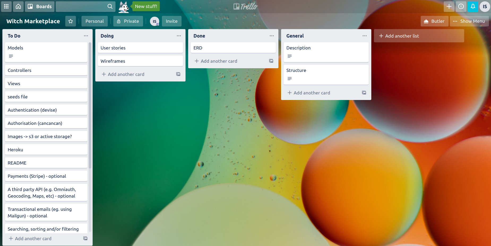

# README

# Rails app: Witch Marketplace

[GitHub repo](https://github.com/IraShy/witch-marketplace)

[Deployed to Heroku](https://pure-hamlet-74826.herokuapp.com/)

------
## Problem 

By building the witch marketplace app, I am solving a problem of shortage of witch marketplaces online. 

The other night, I wanted to buy some moonligth because it was rather dark and I just wanted to add some cozyness to our family dinner. I have a witch as a neighbour and was hoping to find what I needed at hers - alas, there was no light of any nature.

I believe that if there were more online stores and marketplaces for witches and wizards, magic folk and average people like myself would find it helpful to buy what they need. 

Also, using my app could help folks to sell their products to a more broad audience and have some extra money for new experiments or travel.

----
## Description of the app

### Purpose
The purpose of the app is to bring together both sellers of magical goods and buyers. My Witch Marketplace app is a two sided marketplace, meaning it can be used by sellers and buyers alike. A user can add their products for sale and buy other users' products.

### Functionality / features
- Being **CRUD**, the app lets users to add, view, edit and delete items. 

- I have several **categories** for products, every product belongs to a category. Categories are listed on the sidebar, and by clicking on a category a user redirects to a page where all unsold products in that category are listed.

- On a product show page, under the product I display up to three **similar products** if they exist. The "main" product is never shown as similar.

- On the main page, only the **last six** added products are shown.

- **Authorization** is used to ensure that only eligible users can perform certain actions - e.g., only admin can add, edit and delete categories, or only product owner and admin can edit or delete the product, etc. I used *CanCanCan* to impliment this feature.

- **Authentication** is used to ensure that a user is logged in before they can do anything different from just browsing. I used *Devise* for authentication.

- I used *Amazon S3 bucket* to **store images** added to the products.

- I implemented **payemnts and a cart**. A user is able to add several products to their cart and proceed to payment. After the payment, they are redirected to the success page where all products from their order are listed together with prices, products names are links to the products pages. A total amount paid is calculated and displayed on the success page as well. To implement payments feature, I used *Stripe* and *Webhook*, as well as *Ultrahook* for the local server.

- After the payment, sold items are no longer shown on the app but can be found on owner's **user dashboard**. At the moment of writing this, only one's sold and unsold products are visible on user dashboard - but potentially, purchase history can be added with existing functionality.

- **Admin dashboard** shows all products, sold and unsold. Admin can also access categories list from their dashboard and create a new category.

### Sitemap


From Home page, a user can access Product Show page, view any Category page, Add a new product or go to Dashboard. 

From Product show page, they can return Home or to Category page, or add the product to cart and go to Cart. 

From Cart, user can go to payment and be redirected to Success page, from which they can go Home or to Dashboard.

From Dashboard page the user can access Home page or Add new product.

### Screenshots

Index page:


Category show page:


Single product view page:


Similar products for current product:


Product edit form:


New product form:


### Target audience

Target audience is witches and wizards, especially younger generations as they are expected to be progressive and not turn away from muggle technology.

Normal people who cosplay witches and wizards are target audience as well, as they will be highly interested in acquiring assets specific to magic world.

### Tech stack 

- Ruby on Rails
- PostgreSQL
- HTML
- CSS
- Stripe
- Webhook
- AWS S3 bucket
- Heroku
- VS Code
- Ubuntu

----
## User stories 

1. As a User, when I visit the home page and when I click “Sign Up” and fill in the Name, Email, and Password fields and click “Submit”, then I should be signed up and stay on the home page
  
2. As a User, when I click “Add a new ad”, and I fill in the Product name, Description, Image, and Price and I click “Submit”, then I should be able to see the new product page with its name, image and price displayed on it.

3. As a signed in User, when I visit the home page or a category page and click “View“ next to a product, then I should be redirected to the product show page.

4. As a signed in User, when I click "Edit" next to my product and change any or all fields of the product, and I click "Aye", then I should see the updated product page.

5. As a signed in User, when I click "Delete" next to my product, then I should see "Are you sure?" pop up message, and when I click "Yes", then I should be redirected to the main page and my product should not be available for sale.

6. As a signed in User, when I visit a product show page and click "Add to cart", and click to "Pay now", and I fill in my payment details, then I should be able to see "Successful payment" message and my order details and total amount paid.

7. As a signed in User who has products for sale, when I visit my Dashboard I should be able to see my sold and unsold products.

8. As the Admin, when I visit index page or a category page, I should be able to see "View", "Edit" and "Delete" buttons next to all products.

9. As the Admin, when I click "Edit" next to any product and change any or all fields of the product, and I click "Aye", then I should see the updated product page.

10. As the Admin, when I click "Delete" next to any product, then I should see "Are you sure?" pop up message, and when I click "Yes", then I should be redirected to the main page and the product should not be available for sale.

11. As the Admin, when I visit my Dashboard and I click "View categories", then I should be able to see a list of all categories.

12. As the Admin, when I click "Edit" next to a category, and I change any or all fields of the category, and I click "Aye", then I should see the updated category page.

13. As the Admin, when I click "Delete" next to a category, then I should see "Are you sure?" pop up message, and when I click "Yes", then I should be redirected to the main page and the category should not be seen in the list of categories.

14. As a signed in User, when I click "Log out", I should be redirected to the main page and not be signed in anymore.

----
## Wireframes

Main page:


Product show page:


Category show page:


Dashboard page:


Add  new ad page:


Success page:


Log in page:


----
## ERD


In Witch Marketplace app, I used the following tables:

- users - storing users detaiils: name, email, password

- categories - this table holds category names, descriptions and images

- products - storing name, description, image and price for products, and also foreign keys for categories and users

- orders - this table stores information on orders: user_id (buyer) and state. The states used in the app are "open" and "paid", but potentially it can be changed to "shipped", "delivered", "refunded", etc.

- order_products - this table is used to establish many-to-many relationship between orders and products.

I have included the code I used to create the ERD in db/dbdigram.dbml in witch marketplace application code.

----
## High-level components (abstractions) in my app

## Active Record

Model classes in my app inherit from Application Record class, which inherits from Active Record. Active Record represents Model part in MVC structure of the app, it allows my models to use methods for data manipulating - read, add, update, and delete records. 

The CRUD methods are performed directly in the database, and changes automatically applied to the tables due to the Object Relational Mapping - so that I don't need to write SQL queries directly. Tables entries in my database are automatically mapped with my models' attributes. 

A quick example of using model methods to read data:

```ruby
@categories = Category.all.order('name')
```
In the example above, I get all entries from my categories table which is connected to my Category model, and I also order the entries alphabetically to present them as a list for the admin to view all categories.

Any restrictions (validations) on tables attributes are defined in models, as well as relationships:

```ruby
class Category < ApplicationRecord
  validates :name, presence: true, length: { in: 2..30 }
  has_many :products
end
```

## Action Controller

Action Controller is the highest in the controllers hierarchy. Application Controller inherits from Action Controller, and the rest of controllers inherit from the Application Controller. 

Action Controller is the C in MVC, it makes sure that my controllers understand requests sent through routes and respond appropriately - a controller will get data from a model and prepare it for a view for output. Controllers also deliver user's input to models.

For example, when the following get request is sent, the router determines which controller and which action in the controller are called: 

```ruby
get "/payments/success", to: "payments#success"
```
In the example above, success action in the payments controller is called.

```ruby
def success
  @order = Order.find(params[:productId])
  @total = 0
  @order.products.each do |product|
  @total += product.price
end
```    

Action Controller, after calling the success action, will retrieve data from the Order model and render success.html.erb in views/paymetns, and it will pass the variables defined in the controller method to the views.

Action Controller by default renders views template with similar name, but I also use redirects for some actions or render a template for a different action, like in the example below:

```ruby
def create
  @category = Category.create(category_params)

  if @category.save
    redirect_to @category
  else
    render :new
  end
end
```  

In the example above, a create action is performed by the categories controller -> the Category model creates a new entry using the parameters passed by the controller -> if the data is valid, the new entry is added to the categories table -> then the controller receives this new entry and creates @category variable and redirects to the views/categories/show page using these params. If by some reason the entry was not saved, categories controller renders the /new page again, so that the user can create an entry.

## Action View
Action View is the V component in MVC. It is responsible for rendering views templates, partials and layouts I have in my app. 

I use Action View ERB templates in my app. They are written in embedded ruby and have .html.erb extension. They include html tags and ruby code wrapped in ```<% %>``` and ```<%= %>``` tags.

Below is a code snippet from my success.html.erb file to demonstrate what it can look like:

```erb
</table>
  <h2>Total paid:</h2>
  <%= price_display(@total) %> 
</div>
```
Although views should not be used for data manipulation or performing business logic, Active View lets us perform some simple actions without having to call a controller for them. For example, in the code snippet below I iterate over a collection of unsold items and render partial _card.html.erb for every product in the collection:

```erb
<h3>Unsold products:</h3>
  <% @unsold_products.each do |product| %> 
    <%= render 'card', product: product %>
  <% end %>
  ```

Partials are used in Action View to be re-used in different templates.

Layouts are used in my app to render a partial to views.

```erb
<%= render "shared/navbar" %>
<%= render "shared/sidebar" if @show_sidebar %>
```    
In the example above, I render a navbar partial to all pages and a sidebar partial to selected pages.

Action View provides many helpers, some of them are used in this app, e.g. FormHelper and AssetTagHelper.

## Active Storage

Active Storage helps me upload images I use for products to the Amazon S3 service, and it attaches the images to my products. I use the ```has_one_attached``` macro to map the images to products.

Active Storage supports uploading images directly from a client to the cloud.

----
## Third party services

- Amazon S3 

Amazon S3 bucket as a cloud storage which I used to store images attached to the products. The basic storage units are organized into buckets. Each bucket is identified with a key and can be managed from Amazon console.

- Stripe 

I used Stripe to handle payments in the app. Stripe is a reliable online payment system providing fraud prevention, it is easy to set up and lets developers use it in testin mode.

- Heroku 

I used Heroku for the app deployment. Heroku is a cloude platform as a service supporting Ruby among other languages.

---
## My projects models 

In Witch Marketplace app, I created the following models:

- User
- Product
- Category
- Order
- Order_Product

Relationships:

1. User <--> Product:
- user has many products 
- product belongs to user

2. User <--> Order:
- user has many orders
- order belongs to user (the buyer)

3. Category <--> Product:
- category has many products
- product belongs to category

4. Order <--> Product:
- order has many products
- product has many orders 

The many-to-many relationship needs to be set up using a join table - thus, I created the Order_Product model, and the relationships were defined as follows:

4. a
- product has many order_products
- order_product belongs to product

4. b
- order has many order_products
- order_product belongs to order

4. c
- product has many orders, through order_products
- order has many products, through order_products

All the above relationships are declared in corresponding models, for example:

```ruby
class OrderProduct < ApplicationRecord
  belongs_to :order
  belongs_to :product
end
```
```ruby
class Order < ApplicationRecord
  belongs_to :user
  has_many :order_products
  has_many :products, through: :order_products
end
```


I have the following tables in my app (the following are snippets from my schema file):

1. users:

```ruby
create_table "users", force: :cascade do |t|
  t.string "email", default: "", null: false
  t.string "encrypted_password", default: "", null: false
  t.string "reset_password_token"
  t.datetime "reset_password_sent_at"
  t.datetime "remember_created_at"
  t.datetime "created_at", precision: 6, null: false
  t.datetime "updated_at", precision: 6, null: false
  t.string "name"
  t.boolean "admin", default: false, null: false
  t.index ["email"], name: "index_users_on_email", unique: true
  t.index ["reset_password_token"], name: "index_users_on_reset_password_token", unique: true
end
```
The admin attribute is false by default for all users. I explicitely create the admin user by chosing admin:true.

I use strings for name because I think 255 characters should be enough for a name, and the rest of attributes were created by devise automatically.


2. products:

```ruby
create_table "products", force: :cascade do |t|
  t.string "name"
  t.string "description"
  t.string "image"
  t.integer "price"
  t.datetime "created_at", precision: 6, null: false
  t.datetime "updated_at", precision: 6, null: false
  t.bigint "category_id", null: false
  t.bigint "user_id", null: false
  t.boolean "sold", default: false, null: false
  t.index ["category_id"], name: "index_products_on_category_id"
  t.index ["user_id"], name: "index_products_on_user_id"
end
  ```

As above, I believe that string should cover the needs for the name and description. 

I used a string for images because images will be uploaded following the url provided by users - they can be stored as strings.

I used an integer for price because I store products' prices in cents.

user_id and category_id are foreign keys connecting the products table to users and categories tables. I have the foreign keys in this table because the relationships are: product belongs to category and product belongs to user.

Another attribute I used for products is sold - it is boolean and is false by default. When a product gets paid for, its sold attribute value becomes true, and after that the product does not appear on the products pages.

3. categories:

```ruby
create_table "categories", force: :cascade do |t|
  t.string "name"
  t.datetime "created_at", precision: 6, null: false
  t.datetime "updated_at", precision: 6, null: false
  t.string "description"
  t.string "image"
end
  ```


4. orders:

```ruby
create_table "orders", force: :cascade do |t|
  t.string "state"
  t.bigint "user_id", null: false
  t.datetime "created_at", precision: 6, null: false
  t.datetime "updated_at", precision: 6, null: false
  t.index ["user_id"], name: "index_orders_on_user_id"
end
```

State is an order status: can be "open", "paid", "shipped", etc. A string value is enough to store this kind of data.

user_id is a foreign key connecting orders table with users table. A user connected to an order is a buyer.

5. order_products join table:

```ruby
create_table "order_products", force: :cascade do |t|
  t.bigint "order_id", null: false
  t.bigint "product_id", null: false
  t.datetime "created_at", precision: 6, null: false
  t.datetime "updated_at", precision: 6, null: false
  t.index ["order_id"], name: "index_order_products_on_order_id"
  t.index ["product_id"], name: "index_order_products_on_product_id"
end
```

Being a join table, it only has foreign keys for orders and products. This table is used to connect the two and to keep the database normalised. 

**How it works:**

Product belongs to User (a Seller). Another user (a Buyer) puts the Product in cart, and an Order is created (I am discussing the case when there is no open Order for the Buyer at the moment).

The Order has Buyer id and Product id, so we know who makes a purchase and what is being purchased. The Product has Seller id, so we know who sells it. The Buyer can add many Products to cart, thet's why I need an order to have many products. 

This has not been implemented yet, but potemtially Seller can sell many similar products, so the same product could appear in many orders - this is why I needed the many-to-many relationship.

The Order_Product keeps Order id and Product id and helps establish the relationship between orders and products.


Relationships between models let me using chaining:

```ruby
@product = current_user.products.create(product_params)
```
The code above creates a new product belonging to the current user.

Another example:

```ruby
similar = @product.category.products.where(sold: false) - [@product]
```

Product belongs to category, so I can make a query using `product.category` - this will return the category to which this product belongs.

Category has products, thus `category.products` is also possible - this will return all products belonging to the category.

The entire line is looking for unsold products belonging to the same category as `@product` and removes the `@product`. I used this to display similar products on a product show page.

---
## Tracking tasks
To allocate and track tasks in my project, I used Trello board. 

The main lists I used were "To Do", "Doing", and "Done", but I also had "General", "Styling", and "Stopped doing for now, finish later if have time" - the last one was for testing, and no, I didn't have time to come back to it to finish by submission deadline.

Day 1:



Several later screenshots from different days:

ERD was changed several times. At first I didn't have the join table in it. Some attributes were added later to different tables.


"Heroku crash". Classic.


A lot of tasks is still on To Do list on the last day...


This is not the first time I used Trello to track tasks. I used it for my portfolio project and for the Rails team 3-day project.

I find Trello very useful  and convenient in tracking tasks, the lists and cards can be quite descriptive, plus it is easy to understand current stage of a project. Cards can be labelled, it is possible to add checklists, etc.


Using Trello for tracking team work just before this assignment was also useful and easy to understand what is being done by different team members, as long as everyone remembers to use Trello and to move cards. 

Last but not least, moving cards to Done is so satisfying, it adds to the feeling of accomplishment.

Also I used "pen and paper" method, writing down and making sketches of what just came to mind.
